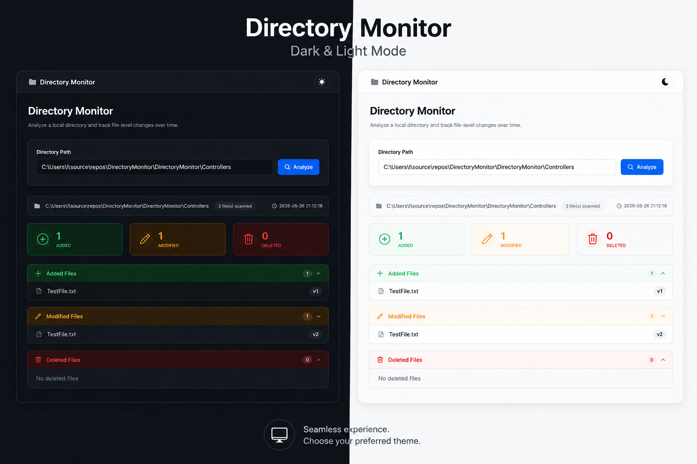
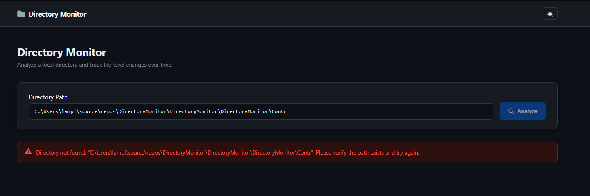
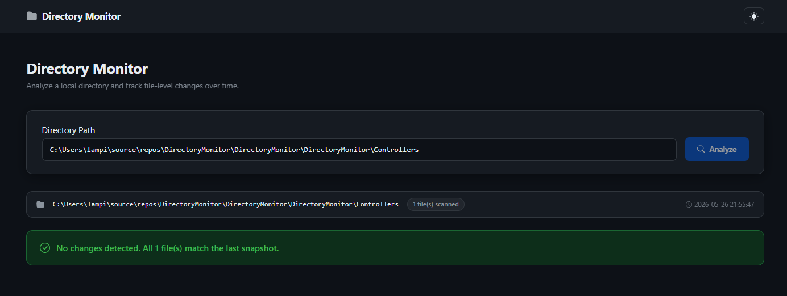
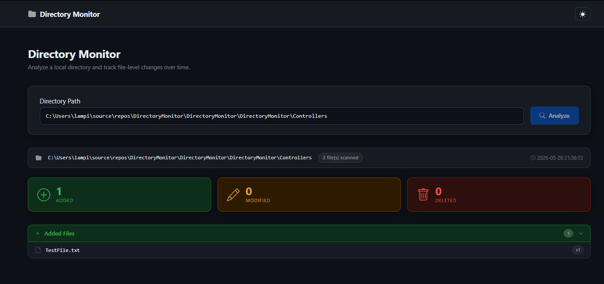
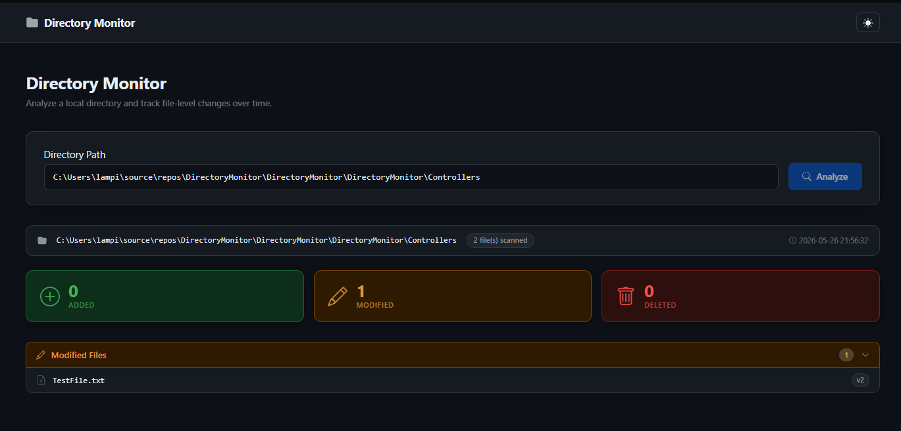
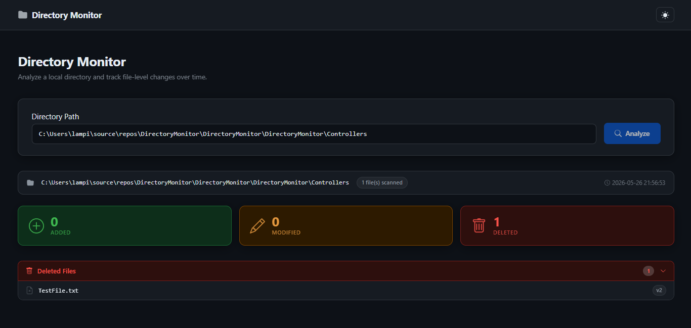

# Directory Monitor

Directory Monitor is an ASP.NET Core MVC application that analyzes local directories, detects file changes, tracks file versions, and persists directory snapshots without using a database.

The project was created as a technical interview assignment with focus on:

* Clean Architecture
* separation of concerns
* maintainability
* testability
* pragmatic backend-oriented design

---

# Features

* Recursive directory analysis
* Detection of:

  * newly added files
  * modified files
  * deleted files and directories
* File version tracking
* SHA256-based file content comparison
* JSON snapshot persistence
* Structured logging
* Centralized exception handling
* Responsive MVC UI
* Dark / Light mode support
* Unit-tested application services

---

# Technology Stack

* ASP.NET Core MVC
* .NET 8
* Bootstrap 5
* xUnit
* NSubstitute
* System.Text.Json
* SHA256 hashing

---

# Architecture

The solution follows pragmatic Clean Architecture principles.

```text
Web (MVC/UI)
    ¡
Application (business orchestration)
    ¡
Domain (entities and business rules)
    ¡
Infrastructure (filesystem + persistence)
```

Dependency direction always points inward.

---

# Project Structure

```text
DirectoryMonitor.sln
-
+¦¦ DirectoryMonitor/                 # ASP.NET Core MVC host
+¦¦ DirectoryMonitor.Application/     # Business logic and interfaces
+¦¦ DirectoryMonitor.Domain/          # Domain entities
+¦¦ DirectoryMonitor.Infrastructure/  # File system and persistence
L¦¦ DirectoryMonitor.Tests/           # Unit tests
```

---

# Key Design Decisions

## SHA256-Based Change Detection

File timestamps are not always reliable indicators of content changes.

To ensure accurate detection of modified files, the application compares SHA256 hashes of file contents instead of relying on filesystem timestamps.

---

## JSON Persistence

The assignment explicitly prohibited database usage.

Directory snapshots are therefore persisted as JSON files, providing:

* lightweight local persistence
* transparency
* easy debugging
* simple deployment

---

## ASP.NET Core MVC

The application uses ASP.NET Core MVC instead of a separate SPA frontend and REST API.

This approach keeps the solution:

* simpler
* easier to maintain
* faster to develop
* and more appropriate for the assignment scope

---

# Snapshot Persistence

Snapshots are stored as JSON files.

Snapshot filenames are generated using SHA256 hashes of normalized directory paths in order to:

* avoid invalid filename characters
* avoid collisions
* keep persistence platform-safe

---

# Testing

The solution includes unit tests for:

* change detection
* snapshot persistence
* hashing services
* analysis orchestration

Testing stack:

* xUnit
* NSubstitute

---

# Screenshots

## Dark / Light Mode



---

## Error Handling

The application validates directory paths and displays user-friendly validation messages.



---

## No Changes Detected

If no file-level changes are detected, the application displays a clean success state.



---

## Added Files Detection

Newly detected files are grouped and versioned automatically.



---

## Modified Files Detection

Modified files are detected using SHA256 content hashing and automatically versioned.



---

## Deleted Files Detection

Removed files and directories are tracked and displayed separately.



---

# Running The Application

## Requirements

* .NET 8 SDK

---

## Run

```bash
dotnet restore
dotnet build
dotnet run --project DirectoryMonitor
```

---

# Example Workflow

1. Enter a local directory path
2. Click Analyze
3. The application scans the directory recursively
4. Existing snapshots are loaded if available
5. File changes are detected
6. Results are displayed in the UI
7. Updated snapshots are persisted

---

# Design Goals

This project intentionally prioritizes:

* readability
* maintainability
* pragmatic architecture
* clean separation of concerns
* production-oriented backend practices

while avoiding unnecessary architectural complexity.
